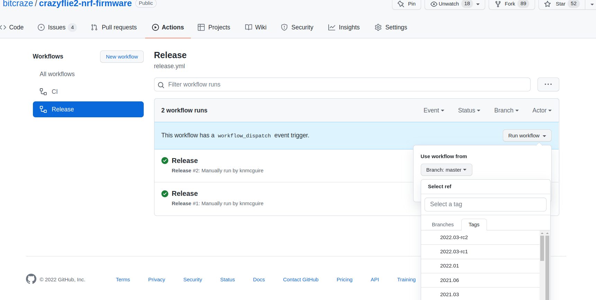

# How to release the firmware using actions

Firmware releases are done from Github Actions.
The overall process is to first tag the repo and then build it on Github Actions. The build will run tests, build binaries, generate a release in github and upload binaries.

Continue to read here underneath for a full detailed checklist for handling of full fw releases and release candidates.

## 1. Preparing the candidate release
1. Tag the crazyflie-firmware and the crazyflie2-nrf-firmware github repo with a release candidate tag in the form of “2022.03-rc1”
1. In github: Collect issues of both repositories in the “next-release” milestone.
1. In github: Rename the milestones to the real release, for instance “2022.03”
1. In github actions on both firmware's repos:
   * select the 'release' flow. Press the down arrow on 'run workflow'
   * select the release candidate tag (see screenshot under)
   * press the green button 'Run Workflow'.
1. Wait until workflows has been finalized
1. Make to two pre-releases of the two repositories public

## 2. Make a candidate release firmware zip folder
1. Locally clone this repository (crazyflie-release)
1. Change the version.json file to include the candidate releases tags
1. Tag the crazyflie-release repository with the candidate release tag (2022.03-rc1)
1. Then got to the actions tab, select release, start the workflow with the candidate release tag (like with the other repositories)
1. Wait until workflow has been finalized, go to the draft release. If you want you can try out the zipfolder generated if it flashes
1. If everything looks okay publish the release as a pre-release in github.

## 3. Do the Crazyflie testing
1. Do all the Crazyflie release testing
    * If all is good, continue!
    * If there is something wrong, fix the issues, and start again to generate a new version of the release candidate for both the firmware and again of the full crazyflie-release

## 4. Preparing the real release
1. Now getting ready for the real release: set the real release tag (like '2022.03') on the crazyflie-firmware and crazyflie2-nrf firmware,
1. Use the release actions with that tag
1. Go to the draft release and input the generate the release notes by `tb ghrn bitcraze/crazyflie-firmware 2022.03` or the automatic functionality in github. 
2. Add a section containing all deprecated functionality in the code base (search for "deprecated").
3. Add an summary release notes that are easier to read
4. Publish the firmware releases (no pre-release checkbox selected)

## 5 Publish the real release
1. Tag the crazyflie-release with the version (2022.03)
1. Use the action workflow to create a draft release
1. Go to the draft release:
    *  add some general, human readable notes about the release (based on the release notes for both the firmware)
    * uncheck the pre-release check
    * press the green button publish
1. Double check with the zip files if they are in working order (flash them from the cfclient)
1. In github: Close the milestones and make a 'next release' milestone for the next
1. In github: remove all candidate releases (all firmware repos)
1. Now write a blogpost about the release!
